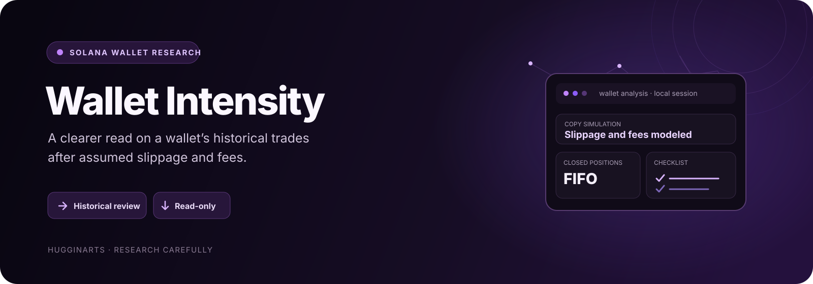
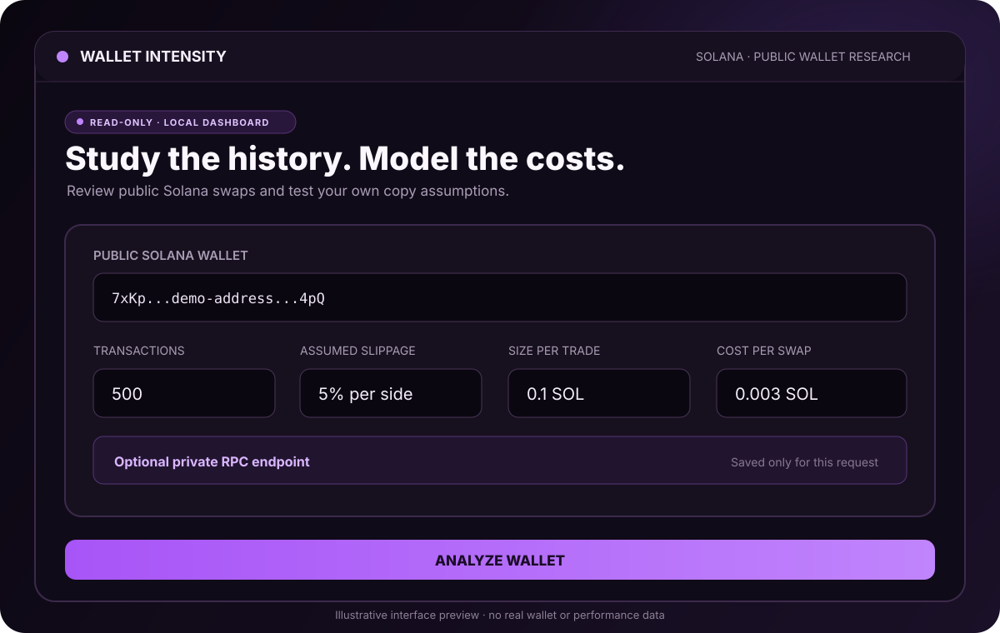
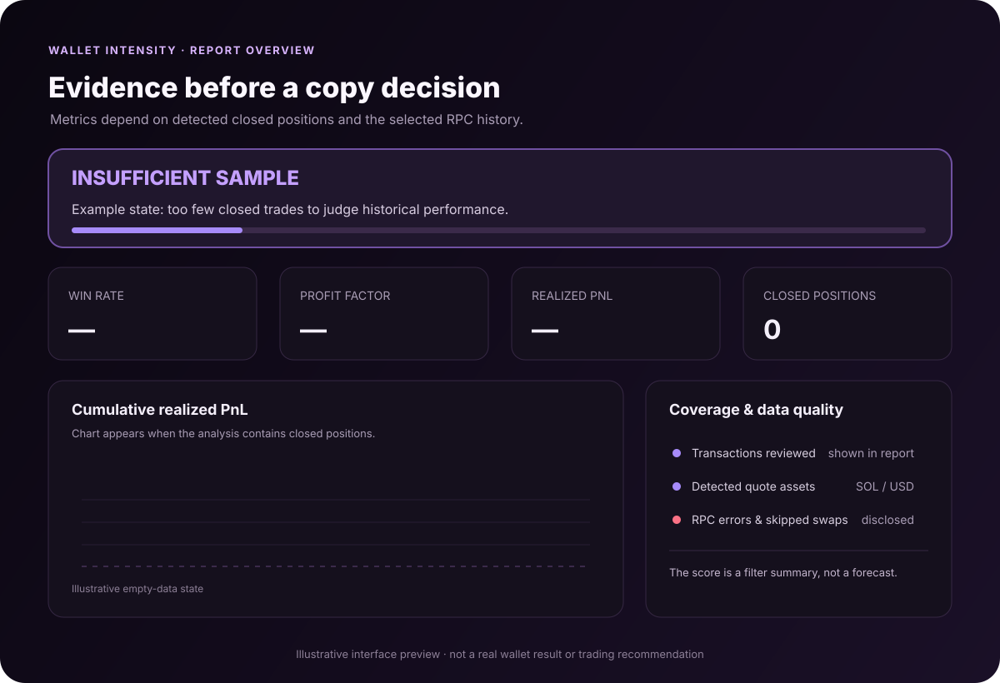
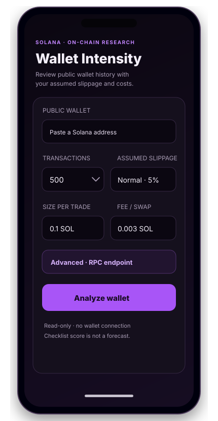

<div align="center">
  

  # Wallet Intensity

  **Analiza el historial público de una wallet de Solana y estima cómo cambiaría el resultado al considerar slippage y costos.**

  `SOLANA` · `TERMUX / ANDROID` · `PYTHON` · `SOLO LECTURA`
</div>

Wallet Intensity es un panel local para estudiar operaciones históricas de una dirección pública. Detecta swaps reconocibles cotizados en **SOL/WSOL o USDC/USDT**, agrupa compras y ventas cerradas y permite probar supuestos de tamaño, slippage y comisión.

> Es una herramienta de investigación retrospectiva. No predice rentabilidad futura, no reproduce el precio disponible al copiar una operación y no envía órdenes.

## Vista del producto

<p align="center">
  
</p>

<p align="center">
  
</p>

*Las imágenes son vistas ilustrativas de la interfaz. No muestran resultados de una wallet real.*

<p align="center">
  
</p>

## Funciones

- **Panel adaptable al teléfono:** se sirve localmente desde Python y se abre en el navegador del mismo dispositivo.
- **Análisis de solo lectura:** consulta una dirección pública; no solicita frase semilla, claves privadas ni conexión de wallet.
- **Swaps SOL y stablecoin:** reconoce swaps cotizados en SOL/WSOL y USDC/USDT que el parser puede separar.
- **Simulación de copia:** configura tamaño por operación, slippage por lado y costo estimado por swap.
- **Métricas históricas:** PnL realizado, win rate, profit factor, drawdown, tenencia mediana, curva de capital y operaciones cerradas.
- **Emparejamiento FIFO:** agrupa compras y ventas por token y moneda de cotización.
- **Informe de cobertura:** detalla transacciones revisadas, swaps detectados, operaciones descartadas, errores del RPC y posiciones abiertas.
- **RPC configurable:** usa el RPC público de Solana o una URL propia. El endpoint se usa para la consulta y no se guarda en el panel.
- **Sin dependencias externas de Python:** el panel y el analizador usan la biblioteca estándar.

## Inicio rápido en Android con Termux

Requiere Python 3.9 o posterior.

```bash
pkg install git python
git clone https://github.com/hugginarts/wallet-intensity-tester.git
cd wallet-intensity-tester
python wallet_intensity_v2.py --port 8766
```

Deja Termux ejecutándose y abre en Chrome, en el mismo teléfono:

```text
http://127.0.0.1:8766
```

Para comprobar que el panel local responde, visita `http://127.0.0.1:8766/health`. Debe mostrar `"ok": true`. Detén el servidor desde Termux con **Ctrl+C**.

## Inicio en una computadora

```bash
python wallet_intensity_v2.py --port 8766
```

Abre `http://127.0.0.1:8766` en el navegador de esa computadora. También puedes analizar una dirección desde la terminal:

```bash
python wallet_intensity_v2.py DIRECCION_PUBLICA --limit 500 --size 0.1 --slip 5 --fee 0.003
```

### Parámetros de terminal

| Opción | Uso | Valor predeterminado |
|---|---|---:|
| `--port` | Puerto del panel local | `8765` |
| `--limit` | Máximo de transacciones a revisar (50–2000) | `500` |
| `--size` | Tamaño supuesto por operación | `0.1` |
| `--slip` | Slippage por lado, en porcentaje | `5` |
| `--fee` | Costo supuesto por swap | `0.003` |
| `--rpc` | Endpoint JSON-RPC de Solana | RPC público |

Para configurar un endpoint RPC por variable de entorno, puedes usar `SOLANA_RPC_URL`. Si la URL contiene una clave de proveedor, no la publiques ni la incluyas en capturas.

## Cómo se calculan los resultados

1. El programa obtiene firmas y transacciones de la dirección mediante JSON-RPC.
2. Examina cambios de SOL/WSOL, USDC/USDT y tokens para detectar swaps reconocibles.
3. Agrupa compras y ventas por token y moneda de cotización con método FIFO.
4. Calcula métricas para posiciones cerradas y simula costos con los valores que elijas.

Si una wallet usa cotizaciones en SOL y USD, el informe elige la moneda más frecuente y muestra las operaciones cotizadas en la otra moneda que excluyó. No suma SOL y USD como si fueran unidades equivalentes. Los saldos abiertos no se valorizan al precio actual.

## Interpretación y límites

- **Datos insuficientes no significa PnL cero.** Si no hay cierres reconocidos, las métricas aparecen como no disponibles.
- Un RPC público puede limitar consultas, tener historial incompleto o no admitir todas las versiones de transacción. El RPC puede hacer que el análisis tarde o falle.
- USDC/USDT se aproximan a 1 USD. El PnL USD no convierte automáticamente la comisión de red pagada en SOL.
- Swaps complejos con varios tokens, transferencias, puentes y operaciones que el parser no pueda separar pueden quedar fuera.
- Una venta puede quedar huérfana si su compra está fuera del historial recuperado.
- El slippage y la comisión son supuestos editables: no representan ejecución real, liquidez ni latencia de copia.
- Un score resume filtros retrospectivos; **no es una probabilidad de ganar ni una recomendación de inversión**.

La consulta `getTransaction` solicita soporte hasta la versión 1. Si tu proveedor no la admite, usa un RPC compatible. Consulta la [documentación de Solana](https://solana.com/docs/rpc/http/gettransaction).

## Desarrollo y pruebas

El proyecto no requiere instalar paquetes de Python.

```bash
python -m py_compile wallet_intensity_v2.py
python -m unittest discover -s tests -v
```

Las contribuciones son bienvenidas. Lee [CONTRIBUTING.md](CONTRIBUTING.md) antes de abrir un issue o pull request. No subas claves RPC, datos privados ni capturas que muestren credenciales.

## English

Wallet Intensity is a **local, read-only Solana wallet research dashboard**. It reviews recognizable SOL/WSOL- and USDC/USDT-quoted swaps, pairs closed positions with FIFO accounting, and models user-entered trade size, slippage, and fees. It reports realized metrics and data coverage, runs in Termux or Python, and never asks for private keys or sends trades.

The screenshots above are illustrative interface previews, not real wallet results. RPC history can be incomplete or rate-limited. Complex swaps may be omitted, open positions are not marked to market, and modeled slippage is not actual execution. Historical scores are not forecasts or investment advice.

## Proyecto

Desarrollado por **HugginArts**. Agradecemos reportes, ideas y pull requests revisables.
